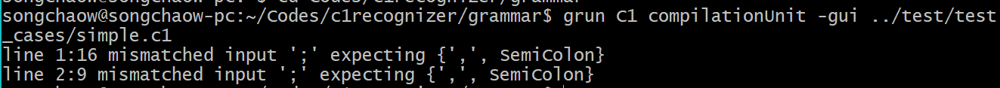
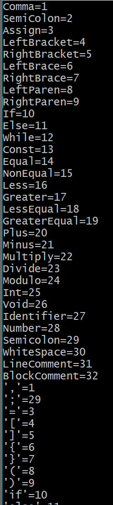
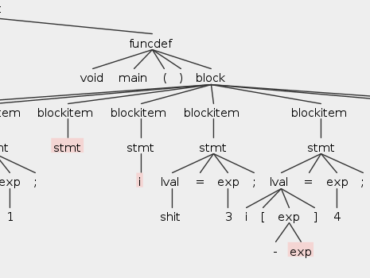
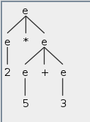
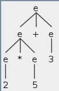

# Lab1-2 `C1`的语法分析

> PB15000102 王嵩超

## 自动化脚本

自动化脚本位于`src/lab_1-2/build.sh`。

可完成从`g4`文件到`class`文件的生成，并在最后对测试源程序进行分析，并弹出GUI显示分析树。

**注意**:

- 请在`src/lab1_2/`目录下运行脚本。
- 请确认java和antlr环境变量已经设置好。

##分析和设计

###some insights about lexer and parser

注意到把Lexer和Parser的设计分开的内涵：

Lexer只包含零散的各种记号，如`+`, `-`, `*`等二元运算符都是分开的，该文件未指明它们之间的任何联系，只是给它们都起了一个名字(`Plus`, `Minus`, `Multiply`)。

而Parser才正式涉及语言的结构。Parser不会直接包含任何`literal`。

每个`C1`源程序都由一个`compilationUnit`组成，`compilationUnit`包括`decl`和`funcdef`。`decl`为对常亮和变量的声明，而`funcdef`是对函数的声明。在`funcdef`内部才出现了语句块`block`的概念。而`block`是包含`decl`和`stmt`。此时注意`decl`作为声明和定义类型，即可出现在函数体内，也可出现在函数外的全局部分。而`stmt`作为程序的“动作”仅允许出现在函数体内。

不再对每个条目的设计赘述。只说个别的：

- 看上去vardef和stmt中的lval Assign exp Semicolon有些重复。

  其实不然。因为vardef中的赋值，是声明变量后顺便初始化值。而lval Assign exp Semicolon是已存在变量后。

> Note that the whitespaces in g4 files just serve for separating various elements in the rule. They won't affect the parser's behavior.

##Records for troubleshooting

- line 1:6 mismatched input '=' expecting {',', SemiColon}

原因： 变量赋值语句中，经验性地将`=`写成了Equal。

- 总是出错：



原因：查看`C1Parser.tokens`，发现Semicolon有两条记录：



Root cause是在编写parser的描述文件时，把部分`SemiColon`写成了`Semicolon`。

## 测试程序

已有的测试文件均已测试通过：

```
declarations.c1
expr.c1 #虽然名字为expr 但内容还是compilationUnit(至少是多个stmt)
lexical_tokens.c1
simple.c1
```

故意编写一个错误`c1`文件`parser_error.c1`，结果如下：



## 重点和难点 回答

### `ANTLR`支持的左递归类型

`ANTLR 4`接受任何不包含间接左递归和隐藏左递归的上下文无关文法。


### `ANTLR`对支持的左递归的处理

对于支持的左递归，会按优先级递减的顺序从第一个可用选择来试探。所以被`|`分隔的第一个选择应是优先级最高的运算。

加规则在乘规则的前一行：

示例位于`grammar/AddFirst.g4`



乘规则在加规则的后一行：

示例位于`grammar/MultFirst.g4`



事实上，处理后的规则为：

```
expr[int pr] : id
			( {4 >= $pr}? '*' expr[5])
			| {3 >= $pr}? '+' expr[4])
			| {2 >= $pr}? '(' expr[0])
```

如果前面的{... >= $pr}条件不成立，则该条选择不会被考虑。这样就避免了二义性。

### 不支持的左递归示例

两种不支持的左递归的示例位于`grammar/UnsupportedLeftRecursive.g4`

间接和隐式左递归均涉及到对多个表达式。如果要全部去除左递归，会导致指数级量级的转换过的语法。故未被采用。

参见：[report](antlr.org/papers/allstar-techreport.pdf)

